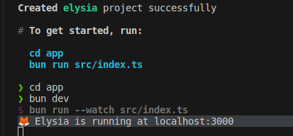
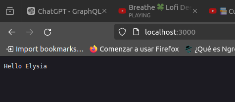
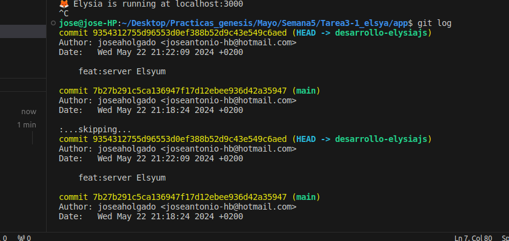

# Elysia Hello World API

This project is a simple Hello World API using the Elysia framework.

## Description

The application provides a basic endpoint that returns a greeting message.

## Installation and Setup

1. **Clone the repository**:
   ```bash
   git clone https://github.com/joseaholgado/Proyecto_Elysia.git
   cd Proyecto_Elysia

2. **Install Bun:**:
    ```bash
    curl https://bun.sh/install | bash

3. **Install dependencies:**:
    ```bash
    bun install

4. **Run the development server:**:
    ```bash
    bun run --watch src/index.ts


## Screenshots and GitHub

1. Server running





2. Repository and commit

https://github.com/joseaholgado/Proyecto_Elysia



